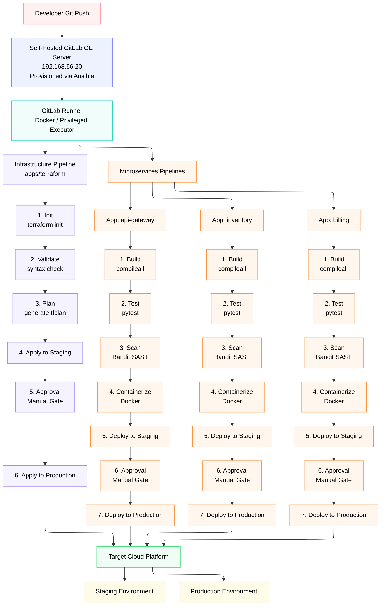

# 🛡️ Code-Keeper: Automated CI/CD & Infrastructure for Microservices

Code-Keeper is a complete DevOps automation project built on top of the **code-keeper** microservices architecture. It automates the provisioning, testing, scanning, containerizing, and zero-downtime deployment of microservices and cloud infrastructure using a self-hosted **GitLab CE** instance and **GitLab Runners** deployed via **Ansible**.

---

## 📑 Table of Contents
- [Architecture Overview](#-architecture-overview)
- [Project Structure & Repositories](#-project-structure--repositories)
- [Ansible Automation (GitLab & Runner)](#-ansible-automation-gitlab--runner)
- [CI/CD Pipelines Design](#-cicd-pipelines-design)
  - [1. Infrastructure Pipeline (Terraform)](#1-infrastructure-pipeline-terraform)
  - [2. Microservices CI/CD Pipelines](#2-microservices-cicd-pipelines)
- [Cybersecurity & Best Practices](#-cybersecurity--best-practices)
- [Prerequisites & Setup Guide](#-prerequisites--setup-guide)
- [Role-Play Audit Q&A Defense Guide](#-role-play-audit-qa-defense-guide)

---

## 🏗️ Architecture Overview


---

## 📦 Project Structure & Repositories

The project separates concerns into **4 independent Git repositories** hosted on the local GitLab instance under the `code-keeper` group:

1. **`code-keeper / terraform`**: Infrastructure as Code (AWS ECS, VPC, RDS, ALB, RabbitMQ).
2. **`code-keeper / api-gateway`**: Entrypoint reverse proxy and HTTP-to-queue routing microservice.
3. **`code-keeper / inventory`**: Movie inventory catalog service connected to PostgreSQL.
4. **`code-keeper / billing`**: Order processing service consuming RabbitMQ queue events.

---

## 🤖 Ansible Automation (GitLab & Runner)

Both GitLab CE and the GitLab Runner are automated using Ansible roles:

* **GitLab Role (`ansible/roles/gitlab`)**:
  * Installs prerequisite packages (`curl`, `ca-certificates`, `tzdata`, `perl`).
  * Downloads and executes the official GitLab repository script.
  * Installs `gitlab-ce`.
  * Deploys optimized `/etc/gitlab/gitlab.rb` (Puma single-process mode, reduced sidekiq concurrency, PostgreSQL shared memory tuned for 4GB VM).
  * Automatically executes `gitlab-ctl reconfigure` and polls until the web UI returns HTTP 200.
* **Runner Role (`ansible/roles/runner`)**:
  * Installs `docker.io` and `gitlab-runner`.
  * Configures the `gitlab-runner` system user in the `docker` group.
  * Sets runner concurrency to 4 and enables privileged execution for Docker-in-Docker.

---

## 🚀 CI/CD Pipelines Design

### 1. Infrastructure Pipeline (`terraform`)
* **`Init`**: Downloads HashiCorp AWS and Random provider plugins.
* **`Validate`**: Validates syntax, HCL structure, and certificate references.
* **`Plan`**: Generates execution plan artifact (`tfplan`).
* **`Apply to Staging`**: Automatically applies changes to the Staging environment.
* **`Approval`**: Manual approval gate (`when: manual`) requiring stakeholder sign-off.
* **`Apply to Production`**: Applies the reviewed plan to the Production environment.

### 2. Microservices CI/CD Pipelines (`api-gateway`, `inventory`, `billing`)
* **`Build`**: Validates bytecode compilation (`python -m compileall app/`).
* **`Test`**: Executes automated unit test suite using `python -m pytest -v` with in-memory database mocks.
* **`Scan`**: Analyzes Python source code for security vulnerabilities and dangerous patterns using **Bandit** SAST (`bandit -r app/ -ll -i`).
* **`Containerize`**: Builds container images using `docker build -t <app>:latest .` via Docker-in-Docker service.
* **`Deploy to Staging`**: Deploys the container to the Staging environment with automated health checks.
* **`Approval`**: Enforces a strict manual approval gate (`when: manual`) before touching production.
* **`Deploy to Production`**: Executes a zero-downtime rolling update to the live Production environment.

---

## 🔒 Cybersecurity & Best Practices

In accordance with project security guidelines:
1. **Protected Branches**: Pipelines and production deployments only trigger from the protected `main` branch.
2. **Separation of Secrets from Code**: Zero hardcoded credentials. AWS keys (`AWS_ACCESS_KEY_ID`, `AWS_SECRET_ACCESS_KEY`, `AWS_DEFAULT_REGION`) are stored as **Masked Variables** in GitLab CI/CD settings.
3. **Least Privilege & Access Control**: Public sign-ups are disabled (`Allow new user accounts = false`), preventing unauthorized registration.
4. **Automated Security Scanning**: Every code commit is scanned by Bandit before any container is built or deployed.

---

## 🛠️ Prerequisites & Setup Guide

### 1. Booting the GitLab VM
```bash
vagrant up gitlab
```

### 2. Configure google DNS
```bash
vagrant ssh gitlab
sudo resolvectl dns enp0s3 8.8.8.8 1.1.1.1
sudo resolvectl flush-caches
# Prioritize IPv4 over IPv6 in /etc/gai.conf
sudo sed -i 's/#precedence ::ffff:0:0\/96 100/precedence ::ffff:0:0\/96 100/' /etc/gai.conf
exit
```

### 3. Running Ansible Provisioning
```bash
cd ansible
export ANSIBLE_CONFIG=./ansible.cfg
ansible-playbook playbooks/deploy_gitlab.yml
ansible-playbook playbooks/deploy_runner.yml
```

### 4. Accessing GitLab

- **URL**: http://192.168.56.20
- **Username**: root
- **Password**: StrongPassword!


---
