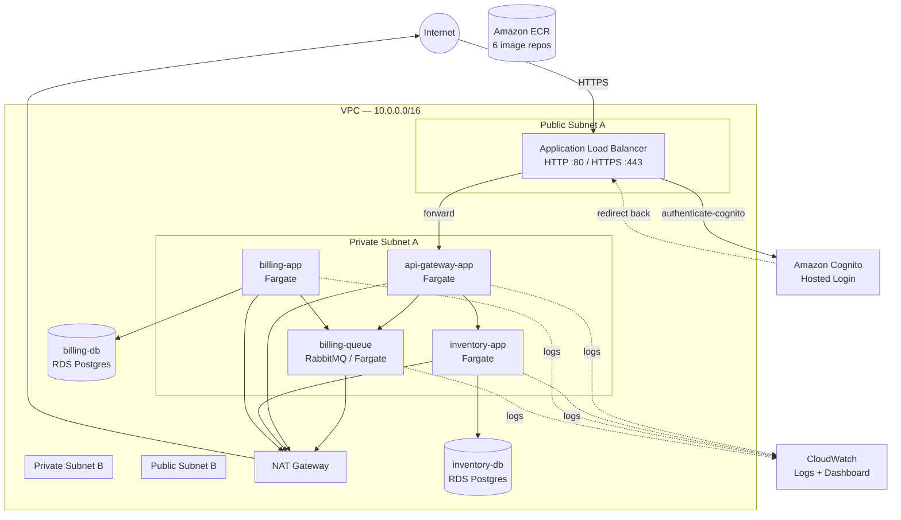

# Cloud-Design: Microservices Architecture on AWS

A re-deployment of the **Orchestrator** microservices project (originally K3s/Vagrant) onto real AWS infrastructure, provisioned entirely with Terraform, running on ECS Fargate.

## Table of Contents

- [Architecture Overview](#architecture-overview)
- [Components](#components)
- [Design Decisions & Trade-offs](#design-decisions--trade-offs)
- [Security](#security)
- [Auto-Scaling](#auto-scaling)
- [Monitoring & Logging](#monitoring--logging)
- [Prerequisites](#prerequisites)
- [Setup & Deployment](#setup--deployment)
- [Configuration Reference](#configuration-reference)
- [Usage & Testing](#usage--testing)
- [Load Testing](#load-testing)
- [Cost Management](#cost-management)
- [Known Limitations](#known-limitations)

---

## Architecture Overview



**Traffic flow:** Internet → ALB (HTTPS) → Cognito login gate → `api-gateway-app` (private) → `inventory-app` / `billing-queue` (private, via internal DNS) → respective databases (private, RDS).

The only publicly-addressable resource is the Application Load Balancer, sitting across two public subnets in two Availability Zones. Every application container, both databases, and the message queue live in private subnets with no direct route from the internet.

---

## Components

| Component | Runtime | Network | Purpose |
|---|---|---|---|
| `api-gateway-app` | ECS Fargate | Private (behind ALB) | Single public entry point; routes to inventory-app, publishes to billing-queue |
| `inventory-app` | ECS Fargate | Private | Movies/inventory REST API, backed by `inventory-db` |
| `billing-app` | ECS Fargate | Private | Consumes orders from `billing-queue`, writes to `billing-db` |
| `billing-queue` | ECS Fargate (containerized RabbitMQ) | Private | Message broker between gateway and billing-app |
| `inventory-db` | RDS PostgreSQL | Private | Movies/inventory data |
| `billing-db` | RDS PostgreSQL | Private | Orders/billing data |

Internal service-to-service communication uses **AWS Cloud Map** for DNS-based service discovery (`*.cloud-design.local`), replacing the automatic DNS that Kubernetes provided in the original Orchestrator setup.

---

## Design Decisions & Trade-offs

This project was built under a strict "use only what the subject asks for, minimize cost" constraint. Several deliberate scoping decisions were made, all defensible and documented here rather than hidden:

| Decision | Reasoning |
|---|---|
| **ECS Fargate over EKS** | EKS's control plane costs ~$73/month flat, regardless of usage. ECS has no equivalent fixed fee — only pay for running tasks. Given this is a learning/audit project, not a long-running production system, ECS was the cost-rational choice. |
| **Single NAT Gateway (not per-AZ)** | Redundant NAT Gateways double that cost for HA on a path that's only used for image pulls / log delivery, not live application traffic. One NAT Gateway was accepted as a reasonable trade-off. |
| **RDS Single-AZ (no Multi-AZ)** | Multi-AZ roughly doubles RDS cost by running a live standby. For this project's scope, Single-AZ was chosen; Multi-AZ would be the production recommendation. |
| **Self-signed certificate via ACM (not a public CA)** | AWS Certificate Manager was used for HTTPS as required, but a publicly-trusted certificate requires owning a domain name for validation. No domain was in scope for this project, so a self-signed certificate was generated and *imported* into ACM instead — this still results in genuine TLS termination at the ALB, managed by ACM, just without a browser-trusted certificate. Browsers will show a certificate warning; this is expected and documented, not a bug. |
| **AWS Systems Manager Parameter Store over Secrets Manager** | Both provide encrypted-at-rest secret storage. Secrets Manager, however, charges per secret per month; Parameter Store's `SecureString` type is free for standard usage. Since neither the subject nor the security posture required the paid feature set of Secrets Manager, Parameter Store was used instead. |
| **Application Load Balancer over Amazon API Gateway (the AWS service)** | The subject lists API Gateway as one *example* of a security best practice ("such as"), not a hard requirement. Replacing the ALB with API Gateway + VPC Link would be a full re-architecture with no functional security gain over the ALB + security-group-chain + Cognito approach already in place. |
| **ECR basic scanning over Amazon Inspector enhanced scanning** | Basic scan-on-push (enabled on every repository) performs real vulnerability scanning at no extra cost. Enhanced scanning integrates more deeply with Inspector but bills per image scanned — not adopted, since basic scanning already satisfies "regularly scanning for vulnerabilities." |
| **Auto-scaling on `api-gateway-app` only** | Matches the scope of the original Orchestrator project's Kubernetes HorizontalPodAutoscaler, which was also gateway-only. |

---

## Security

- **Network isolation:** VPC with 2 public / 2 private subnets across 2 Availability Zones. Only the ALB sits in public subnets; every application container, both RDS instances, and the queue are private-only.
- **Least-privilege security groups:** A strict chain — `alb-sg` → `gateway-sg` → `app-sg` → `db-sg` / `queue-sg`, plus an explicit `gateway-sg → queue-sg` rule for the gateway's direct publish path. No security group allows broader access than the layer directly above it.
- **HTTPS via AWS Certificate Manager:** ALB terminates TLS on port 443 using a certificate imported into ACM (see [Design Decisions](#design-decisions--trade-offs) for the self-signed caveat).
- **Managed authentication via Amazon Cognito:** The ALB's HTTPS listener enforces an `authenticate-cognito` action before forwarding any request — unauthenticated visitors are redirected to a Cognito-hosted login page. The gateway application itself required zero code changes; authentication is fully handled at the load balancer.
- **Secrets management:** All database and RabbitMQ passwords are generated with Terraform's `random_password` and stored in AWS Systems Manager Parameter Store as `SecureString` values (KMS-encrypted). Task definitions reference them via the ECS `secrets` mechanism — no plaintext credentials appear in Terraform state as literal task definition values, and none are baked into any container image.
- **IAM least privilege:** The ECS task execution role is scoped to exactly what's needed — ECR image pulls, CloudWatch log writes, and `ssm:GetParameters`/`kms:Decrypt` limited to the three specific parameter ARNs in use.
- **Vulnerability scanning:** Every ECR repository has `scan_on_push` enabled, automatically scanning every pushed image.

---

## Auto-Scaling

`api-gateway-app` is configured with AWS Application Auto Scaling:

- **Min tasks:** 1
- **Max tasks:** 3
- **Target metric:** Average CPU utilization, target 60%
- **Cooldowns:** 60s scale-in / 60s scale-out

This mirrors the `HorizontalPodAutoscaler` configuration from the original Kubernetes-based Orchestrator project, translated to ECS's equivalent mechanism.

---

## Monitoring & Logging

- **CloudWatch Log Groups** exist for all four containerized services (`api-gateway-app`, `inventory-app`, `billing-app`, `billing-queue`), each with a 7-day retention period to control cost.
- **CloudWatch Dashboard** (`cloud-design-dashboard`) visualizes:
  - Gateway CPU utilization (ties to the auto-scaling metric)
  - ALB request count and target response time
  - Target group health (healthy/unhealthy host count)
  - A live log query widget over the gateway's log group

> **Note on log verbosity:** the application code only logs on error paths (connection failures, exceptions) — successful requests (e.g. a clean `200` from `/api/movies`) produce no log output by design of the original application code, not due to any infrastructure gap. This was verified directly via CloudWatch Logs Insights during testing.

---

## Prerequisites

- An AWS account (Free plan recommended for cost safety)
- AWS CLI v2, configured with an IAM user (not root) with sufficient permissions
- Terraform >= 1.5
- Docker (for image management, if rebuilding any service)
- `openssl` (for generating the self-signed certificate)

---

## Setup & Deployment

### 1. Generate the self-signed certificate

```bash
openssl req -x509 -nodes -days 365 -newkey rsa:2048 \
  -keyout alb-selfsigned.key \
  -out alb-selfsigned.crt \
  -subj "/CN=<your-alb-dns-name-placeholder>"
```

> The ALB doesn't exist yet on first run — use any placeholder CN, or apply once, then regenerate and re-`terraform apply` if you want the CN to exactly match the real ALB DNS name (not functionally required).

### 2. Configure AWS credentials

```bash
aws configure
aws sts get-caller-identity   # confirms you're authenticated as the right IAM user
```

### 3. Provision the infrastructure

```bash
cd terraform
terraform init
terraform plan
terraform apply
```

Apply in the order the resources naturally depend on each other (Terraform handles this automatically via resource references) — expect the RDS instances and NAT Gateway to take several minutes each.

### 4. Push application images to ECR

```bash
aws ecr get-login-password --region us-east-1 | \
  docker login --username AWS --password-stdin <account-id>.dkr.ecr.us-east-1.amazonaws.com

# Repeat for each of the 6 services:
docker tag <local-image> <account-id>.dkr.ecr.us-east-1.amazonaws.com/cloud-design/<service-name>:latest
docker push <account-id>.dkr.ecr.us-east-1.amazonaws.com/cloud-design/<service-name>:latest
```

### 5. Create a Cognito test user

```bash
aws cognito-idp admin-create-user \
  --user-pool-id <user-pool-id> \
  --username testuser \
  --user-attributes Name=email,Value=test@example.com \
  --temporary-password TempPass123!

aws cognito-idp admin-set-user-password \
  --user-pool-id <user-pool-id> \
  --username testuser \
  --password RealPass123! \
  --permanent
```

---

## Configuration Reference

Key environment variables and their sources, by service:

| Service | Variable | Source |
|---|---|---|
| `api-gateway-app` | `APIGATEWAY_PORT`, `INVENTORY_APP_HOST/PORT`, `RABBITMQ_HOST/PORT/QUEUE/USER` | Plain environment (Terraform) |
| | `RABBITMQ_PASSWORD` | SSM Parameter Store (`SecureString`) |
| `inventory-app` | `INVENTORY_APP_PORT`, `INVENTORY_DB_NAME/USER` | Plain environment |
| | `INVENTORY_DB_PASSWORD` | SSM Parameter Store |
| `billing-app` | `BILLING_DB_NAME/USER`, `RABBITMQ_HOST/PORT/QUEUE/USER` | Plain environment |
| | `BILLING_DB_PASSWORD`, `RABBITMQ_PASSWORD` | SSM Parameter Store |
| `billing-queue` | `RABBITMQ_USER` | Plain environment |
| | `RABBITMQ_PASSWORD` | SSM Parameter Store |

Database names and usernames are treated as non-sensitive configuration; only passwords are stored as encrypted parameters.

---

## Usage & Testing

Once deployed, all traffic goes through the ALB's HTTPS listener and requires Cognito authentication (browser recommended, for cookie handling):

```
https://<alb-dns-name>/api/movies
```

Example authenticated flow:
1. Visit the URL above in a browser
2. Accept the self-signed certificate warning
3. Log in via the Cognito-hosted page
4. Redirected back to the app, now authenticated

**Example endpoints:**

```bash
# List movies (via inventory-app)
curl -k https://<alb-dns-name>/api/movies

# Submit a billing order (published to billing-queue, consumed by billing-app)
curl -k -X POST https://<alb-dns-name>/api/billing/ \
  -H "Content-Type: application/json" \
  -d '{"user_id": 1, "number_of_items": 3, "total_amount": 49.99}'
```

> `curl` alone will hit Cognito's login redirect unless it carries a valid session cookie — use a browser, or attach an authenticated session cookie manually for CLI testing.

---

## Load Testing

Auto-scaling was verified by generating sustained authenticated load against `/api/movies` from an active browser session (using `fetch` with `credentials: 'include'` to preserve the Cognito session), and observing:

- Gateway CPU utilization rising above the 60% target threshold
- ECS Service auto scaling increasing `desired_count` beyond 1
- ALB request count and target health metrics moving accordingly on the CloudWatch dashboard

Plain unauthenticated load (e.g. a bare `curl` loop) was found to **not** reach the application at all post-Cognito — every request is redirected by the ALB before ever reaching the target group, which is itself a confirmation that the authentication layer is functioning correctly.

---

## Cost Management

- AWS Free plan used throughout, with a Budget alert configured at low thresholds (50/80/100%) to catch unexpected spend early.
- Continuously-billed resources in this project: NAT Gateway, both RDS instances, the ALB. All other resources (VPC, subnets, security groups, ECR, Cognito, Parameter Store, CloudWatch dashboard) are free or usage-based with negligible cost at this scale.
- **To stop all charges:** `terraform destroy` from the `terraform/` directory removes every resource in reverse dependency order.

---

## Known Limitations

- **Self-signed certificate:** browsers will show an untrusted-certificate warning. A production deployment would use a real domain with ACM's standard DNS-validated certificate issuance.
- **`billing-queue` has a brief unavailability window on every redeploy:** its startup script (`setup_rq.sh`) starts RabbitMQ, creates the application user, stops the broker, then restarts it — during the stop/restart window (roughly 60-90 seconds), the container is marked `RUNNING` by ECS but the RabbitMQ process itself is briefly unreachable.
- **No data persistence for `billing-queue`:** Fargate's ephemeral storage means every container restart is effectively a fresh RabbitMQ instance; any unconsumed messages at the time of a restart are lost. Acceptable for this project's scope; a production setup would use Amazon MQ (managed RabbitMQ) instead.
- **Application-level access logging** only covers error paths, not successful requests, since this reflects the original application code's own logging behavior, not an infrastructure gap.
